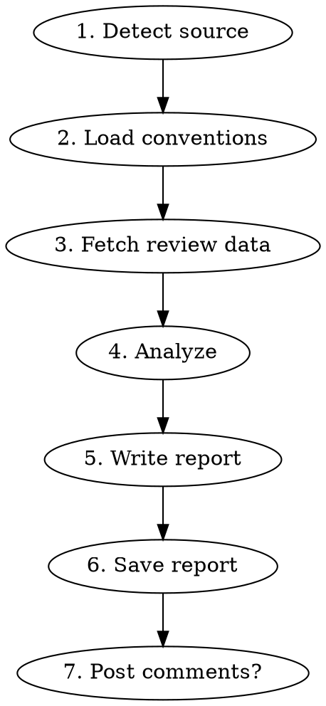

# Code Review with MCP

Structured code review powered by mcp-code-review MCP tools. Works on GitHub PRs, GitLab MRs, local git diffs, single files, and full projects.

## When to Use

- "Review this PR / MR"
- "Do a code review of the diff"
- "Review this file"
- "Scan this project for issues"
- Any request to analyze code quality, security, or performance

## Prerequisites

The `mcp-code-review` MCP server must be configured and running. Tools used:
- `review_github_pr`, `review_gitlab_mr`, `review_diff`, `review_file`, `review_project`
- `get_conventions`, `list_analyzers`
- `save_review_report`
- `post_github_review`, `post_gitlab_review`

## Process



---

## Phase 1: Detect Source

Determine what to review from the user's request:

| User says | Source | Tool to call |
|-----------|--------|-------------|
| URL with `github.com/.../pull/N` | GitHub PR | `review_github_pr` |
| URL with `gitlab.com/.../-/merge_requests/N` | GitLab MR | `review_gitlab_mr` |
| "review the diff" / "review my changes" | Local diff | `review_diff` |
| "review this file" + path | Single file | `review_file` |
| "scan the project" / "review the project" | Full project | `review_project` |

If the user provides a URL, parse it automatically. If ambiguous, ask.

## Phase 2: Load Conventions

Call `get_conventions(path)` to understand the project context:
- Language and framework (auto-detected or from `.codereview.yml`)
- Locale for the report (default: English)
- Ignore patterns and custom rules

If the user specifies a language for the report (e.g., "in italiano"), pass `locale="it"` to the review tool.

## Phase 3: Fetch Review Data

Call the appropriate tool from Phase 1. The tool returns structured `ReviewData`:
- Source metadata (title, author, branch, URL)
- File changes with diffs
- Static analysis findings (only for local diffs/files — ruff, bandit)
- Project conventions

## Phase 4: Analyze

This is the core of the review. Reason deeply on the code, not just surface-level checks. Apply software engineering principles rigorously.

### Review Depth

Scale the review depth to the size and nature of the change. Not every PR needs a full SOLID analysis.

| Change size | Files | Depth |
|-------------|-------|-------|
| **Trivial** | 1-2 files, < 20 lines | Correctness, Security. Skip Architecture/SOLID. |
| **Small** | 2-5 files, < 100 lines | Correctness, Security, Code Quality, Testing. Light Architecture check. |
| **Medium** | 5-15 files, < 500 lines | Full checklist. Architecture analysis for new components. |
| **Large** | 15+ files or 500+ lines | Full checklist. Deep Architecture review. Flag if PR should be split. |

### Change Type Awareness

Different change types demand different emphasis. Identify the type from the PR/MR title, description, and diff patterns, then prioritize accordingly:

| Change type | Primary focus | Secondary focus | Can skip |
|-------------|---------------|-----------------|----------|
| **New feature** | Architecture, API Design, Testing | Security, Performance | — |
| **Bug fix** | Correctness (root cause analysis), Regression test | Side effects | Architecture (unless fix reveals design flaw) |
| **Refactor** | Behavior preservation, No functional changes | Architecture improvement | New features (flag if scope creep) |
| **Dependency update** | Dependency Review, Breaking changes | Security advisories | Deep code quality |
| **Migration/schema** | Data Layer, Backward compat, Rollback plan | Performance | Code style |
| **Config/infra** | Security (secrets, permissions), Correctness | — | Code quality, Testing |
| **Documentation** | Accuracy, Completeness | — | Everything else |

### 4.0 PR/MR Description Quality

Before analyzing code, evaluate the PR/MR description itself:

- [ ] **Purpose clear:** Does it explain WHAT the change does and WHY it's needed? Not just "fix bug" — which bug, what was the symptom, what caused it?
- [ ] **Scope defined:** Is it clear what's in scope and what's not? Flag PRs that mix unrelated changes (feature + refactor + bug fix).
- [ ] **Testing instructions:** Does it describe how to test the change? For UI changes, are there screenshots?
- [ ] **Breaking changes noted:** If the change breaks backward compatibility, is it explicitly called out?
- [ ] **Related issues linked:** Are Jira tickets, GitHub issues, or other references included?

If the description is missing or inadequate, flag it as an Important issue. A good PR description is not optional — it's the reviewer's primary context.

### 4.1 Architecture and Design

**SOLID Principles:**
- [ ] **Single Responsibility (SRP):** Does each class/module have one reason to change? Flag classes that mix concerns (e.g., business logic + persistence + formatting in the same class).
- [ ] **Open/Closed (OCP):** Is the code extensible without modification? Flag switch/if-else chains that grow with each new feature — suggest strategy pattern, registry, or polymorphism.
- [ ] **Liskov Substitution (LSP):** Do subtypes honor the contract of their parent? Flag overrides that change behavior in unexpected ways or violate preconditions/postconditions.
- [ ] **Interface Segregation (ISP):** Are interfaces focused? Flag "god interfaces" that force implementors to depend on methods they don't use.
- [ ] **Dependency Inversion (DIP):** Do high-level modules depend on abstractions, not concrete implementations? Flag direct instantiation of infrastructure dependencies (DB clients, HTTP clients, file I/O) inside business logic — suggest injection.

**Coupling and Cohesion:**
- [ ] Low coupling between modules? Flag circular imports, tight dependencies between unrelated modules, or modules that know too much about each other's internals.
- [ ] High cohesion within modules? Flag files that contain unrelated functions grouped by technical layer rather than by domain responsibility.
- [ ] Are module boundaries well-defined? Flag leaking abstractions — internal implementation details exposed through public interfaces.

**Design Patterns (check for misuse and missed opportunities):**
- [ ] Pattern applied correctly? Flag pattern over-engineering (e.g., factory for a single type, observer for a single listener).
- [ ] Missing pattern where it would simplify? Flag complex conditional logic that maps to Strategy, State, or Command. Flag object construction complexity that maps to Builder or Factory.
- [ ] Anti-patterns present? Flag God Object, Spaghetti Code, Shotgun Surgery (one change requires edits in many unrelated places), Feature Envy (method uses more data from another class than its own).

**Separation of Concerns:**
- [ ] Business logic separated from infrastructure (DB, HTTP, filesystem)?
- [ ] Presentation separated from domain logic?
- [ ] Configuration separated from code?
- [ ] Cross-cutting concerns (logging, auth, validation) handled consistently, not scattered?

### 4.2 Correctness

- [ ] Does the code do what the PR/MR description says?
- [ ] Logic errors: off-by-one, wrong operator, inverted condition, missing null check?
- [ ] Edge cases: empty input, zero, negative values, boundary conditions, concurrent access?
- [ ] State management: race conditions, stale state, inconsistent updates?
- [ ] Error propagation: are errors handled where they occur or correctly propagated? Do callers handle error returns?
- [ ] Contract violations: does the function honor its docstring/signature? Does it return what it promises?

### 4.3 Security

- [ ] No hardcoded secrets, tokens, passwords, or API keys
- [ ] Input validation at system boundaries (user input, API responses, file uploads, URL parameters)
- [ ] No injection vectors: SQL injection, XSS, command injection, path traversal, LDAP injection
- [ ] Authentication and authorization checks on every protected endpoint
- [ ] Sensitive data not logged, not in error messages, not in stack traces
- [ ] Cryptography: no custom crypto, no weak algorithms (MD5, SHA1 for security), no hardcoded keys/IVs
- [ ] CSRF/CORS configured correctly for web endpoints
- [ ] Rate limiting on public-facing endpoints
- [ ] Deserialization of untrusted data (pickle, yaml.load without SafeLoader, eval)

### 4.4 Performance

- [ ] N+1 queries: database calls inside loops, missing select_related/prefetch_related (Django), eager loading
- [ ] Unnecessary memory allocation: loading entire datasets when streaming/pagination suffices
- [ ] Missing pagination for large result sets
- [ ] Missing database indexes for new query patterns (especially on foreign keys and filter fields)
- [ ] Expensive operations in hot paths: regex compilation in loops, repeated I/O, synchronous blocking in async context
- [ ] Missing caching where appropriate (repeated identical computations or queries)
- [ ] Connection management: creating new DB/HTTP connections per request instead of pooling
- [ ] Algorithmic complexity: O(n^2) or worse where O(n log n) or O(n) is achievable

### 4.5 Error Handling and Resilience

- [ ] Specific exceptions caught (no bare `except:` or `except Exception:` when a specific type is known)
- [ ] Error messages are actionable — include context (what failed, with what input, what was expected)
- [ ] Resource cleanup in error paths (files, connections, locks) — use context managers or try/finally
- [ ] Fail-fast: invalid state detected early, not deep in the call stack
- [ ] Idempotency: can the operation be safely retried?
- [ ] Graceful degradation: does the system handle partial failures (network timeouts, service unavailability)?
- [ ] No swallowed exceptions (catch-and-ignore without logging)

### 4.6 Code Quality

- [ ] Naming: clear, accurate, intention-revealing (describe what, not how). No abbreviations that require explanation.
- [ ] Function length: functions do one thing and are readable without scrolling. Flag functions > 30 lines — suggest extraction.
- [ ] Nesting depth: max 3 levels of indentation. Flag deep nesting — suggest early returns, guard clauses, or extraction.
- [ ] DRY: no duplicated logic. Flag copy-paste code — suggest extraction to shared function.
- [ ] Dead code: no unused imports, unreachable branches, commented-out code.
- [ ] Magic numbers/strings: flag unnamed constants. Suggest named constants or enums.
- [ ] Consistent with codebase conventions (naming, structure, patterns, formatting).
- [ ] Appropriate level of abstraction: not too abstract (premature generalization) and not too concrete (hardcoded specifics).

### 4.7 Testing

- [ ] New code has tests that verify behavior, not implementation details
- [ ] Tests cover the happy path AND edge cases (empty, null, error, boundary)
- [ ] Tests are independent — no shared mutable state, no order dependency
- [ ] Mocking is minimal — mock at boundaries (external services, I/O), not internal logic
- [ ] Test names describe the scenario and expected outcome
- [ ] No test logic (conditionals, loops in tests) — tests should be linear assertions
- [ ] Regression test for every bug fix (the bug should be reproducible by the test)
- [ ] Existing tests still pass — no silent breakage

### 4.8 API Design (for public interfaces, endpoints, library APIs)

- [ ] Consistent naming and conventions across the API surface
- [ ] Backward compatibility: does the change break existing consumers?
- [ ] Proper HTTP methods and status codes (REST)
- [ ] Input validation with clear error messages
- [ ] Versioning strategy if breaking changes are introduced
- [ ] Response format is consistent and documented

### 4.9 Data Layer (for changes involving database, migrations, schema)

- [ ] **Migration safety:** Can the migration run on a live database without downtime? Flag `NOT NULL` columns without defaults on large tables, `ALTER TABLE` locks, data backfills that scan entire tables.
- [ ] **Rollback plan:** Is the migration reversible? Flag destructive operations (DROP COLUMN, DROP TABLE) without a rollback migration.
- [ ] **Schema design:** Proper field types, constraints, indexes. Flag missing foreign keys, missing `on_delete` behavior, unbounded text fields where a max length is appropriate.
- [ ] **Data integrity:** Are there race conditions between migration and application code? Does the deploy order matter (migrate first vs deploy first)?
- [ ] **Backward compatibility:** Can the old code still work with the new schema during deployment? Flag column renames or type changes that break running code.
- [ ] **Query impact:** Do new fields or indexes affect existing query performance? Flag new queries without EXPLAIN analysis on large tables.
- [ ] **Django-specific:** `makemigrations` generates correct operations? No manual edits that break the migration graph? `RunPython` operations are idempotent?

### 4.10 Dependency Review (for changes adding or updating dependencies)

- [ ] **Necessity:** Is the dependency actually needed? Flag libraries added for trivial functionality that could be a few lines of code.
- [ ] **Maintenance status:** Is the library actively maintained? Check last release date, open issues count, bus factor. Flag abandoned projects (no release in 12+ months).
- [ ] **License compatibility:** Is the license compatible with the project's license? Flag copyleft licenses (GPL) in MIT/Apache projects.
- [ ] **Security:** Any known vulnerabilities? Check CVE databases. Flag dependencies with unpatched security issues.
- [ ] **Size and transitive deps:** How many transitive dependencies does it pull in? Flag heavy libraries for small functionality.
- [ ] **Version pinning:** Is the version properly pinned or constrained? Flag unpinned dependencies (`requests` without version) and overly strict pins (`==1.2.3` when `>=1.2,<2` suffices).
- [ ] **Alternatives:** Are there lighter, better-maintained, or stdlib alternatives?

### 4.11 Observability (for production services and APIs)

- [ ] **Logging:** Key operations logged at appropriate levels? INFO for business events, WARNING for recoverable issues, ERROR for failures. No DEBUG-level noise in production paths.
- [ ] **Structured logging:** Logs include contextual data (request ID, user ID, operation) as structured fields, not interpolated into message strings?
- [ ] **No sensitive data in logs:** PII, tokens, passwords, credit card numbers never logged, even at DEBUG level.
- [ ] **Error logging:** Exceptions logged with stack traces? Error context sufficient to diagnose without reproducing?
- [ ] **Metrics:** Key business and technical metrics exposed? Request latency, error rates, queue depths, cache hit rates where applicable.
- [ ] **Health checks:** New services or endpoints have health/readiness probes?
- [ ] **Alertability:** Can operations detect when this code fails in production? Are there clear signals (error rates, latency spikes) that would trigger alerts?
- [ ] **Traceability:** In distributed systems, are correlation/request IDs propagated across service boundaries?

### 4.12 Concurrency and Async (for concurrent, async, or task-queue code)

- [ ] **Race conditions:** Shared mutable state accessed from multiple threads/tasks without synchronization? Flag globals, class-level mutables, and unprotected shared resources.
- [ ] **Deadlocks:** Multiple locks acquired in inconsistent order? Database transactions that wait on each other?
- [ ] **Task idempotency:** Can async tasks (Celery, background jobs) be safely retried without side effects? Flag tasks that send emails, charge payments, or write data without idempotency keys.
- [ ] **Retry safety:** Are retries configured with backoff? Flag infinite retries or retries on non-transient errors (validation failures, 4xx responses).
- [ ] **Shared state:** Tasks or coroutines sharing mutable state (module-level dicts, caches) without locks or atomic operations?
- [ ] **Async/await correctness:** No synchronous blocking calls (time.sleep, file I/O, DB queries) inside async functions without wrapping in executor? No fire-and-forget coroutines (missing await)?
- [ ] **Transaction boundaries:** Database transactions scoped correctly? No long-running transactions that hold locks? No transaction wrapping external HTTP calls?
- [ ] **Celery-specific:** `acks_late` set for tasks that must not be lost? Task serialization format safe (JSON preferred over pickle)? Result backend cleaned up? Task time limits configured?
- [ ] **Connection safety:** Database/Redis connections not shared across threads or forked processes? Connection pools configured for concurrent workloads?

### 4.13 Documentation

- [ ] Public API changes are documented (docstrings, README, changelog)
- [ ] Non-obvious logic has comments explaining "why", not "what"
- [ ] Breaking changes noted in PR description and changelog
- [ ] Architecture decisions documented (ADR or inline) when introducing new patterns

### Static Analysis Findings

If the review data includes `static_analysis` findings, integrate them:
- Group by severity (error > warning > info)
- For each finding, check if it's a real issue or a false positive
- Include confirmed findings in the report with the linter's rule code

### Static Analysis Findings

If the review data includes `static_analysis` findings, integrate them:
- Group by severity (error > warning > info)
- For each finding, check if it's a real issue or a false positive
- Include confirmed findings in the report with the linter's rule code

### Severity Classification

For each issue found, classify:

| Severity | Criteria | Action |
|----------|----------|--------|
| **Critical** | Security vulnerability, data loss risk, crash in production | Must fix before merge |
| **Important** | Bug, performance problem, missing validation | Should fix before merge |
| **Minor** | Style, naming, minor improvement | Nice to fix, not blocking |
| **Nitpick** | Personal preference, cosmetic | Optional, informational |

## Phase 5: Write Report

Structure the review as a markdown report. Use the locale from conventions for section headers.

### Report Structure

```markdown
# {Code Review title} — {PR/MR title}

**{Date label}:** YYYY-MM-DD
**{Author label}:** {author}
**{Branch label}:** {source} → {target}
**{Files changed label}:** N (+additions -deletions)

---

## {Summary}

[2-3 sentences: what the PR/MR does and overall assessment]

---

## Architecture and Design

[Evaluate SOLID compliance, coupling/cohesion, separation of concerns, design patterns.
Only include this section if architectural issues are found or if the change introduces
new components/modules. For small changes, skip or write "No architectural concerns."]

---

## {Code Quality}

### {Strengths}

[List what's done well — good patterns, clean code, thorough tests, good abstractions]

### {Issues Found}

[For each issue:]

#### Issue N: [title]

**File:** `path/to/file.py:line`
**Severity:** Critical / Important / Minor / Nitpick

```python
# the problematic code
```

**Problem:** [What's wrong and why it matters]

**Suggestion:**
```python
# how to fix it
```

---

## {Static Analysis}

| Tool | Errors | Warnings | Info |
|------|--------|----------|------|
| ruff | N | N | N |
| bandit | N | N | N |

[List significant findings with rule codes]

---

## {Security}

[Security-specific observations or "No security issues found."
Check: OWASP top 10, injection vectors, auth/authz, secrets exposure, crypto misuse]

---

## {Performance}

[Performance-specific observations or "No performance issues found."
Check: N+1 queries, algorithmic complexity, connection pooling, caching, memory]

---

## Error Handling and Resilience

[Error handling assessment or "Error handling is adequate."
Check: specific exceptions, resource cleanup, fail-fast, graceful degradation, idempotency]

---

## Data Layer

[Only include if the change involves database migrations, schema changes, or significant query changes.
Check: migration safety, rollback plan, backward compat, query impact.
Otherwise write "No data layer changes." or omit this section.]

---

## Dependencies

[Only include if new dependencies are added or updated.
Check: necessity, maintenance, license, security, version pinning.
Otherwise omit this section.]

---

## {Severity Summary}

| Issue | Severity | File | Impact |
|-------|----------|------|--------|
| ... | Critical/Important/Minor/Nitpick | file:line | ... |

---

## {Verdict}

- [ ] {Approved}
- [ ] {Approved with reservations}
- [ ] {Changes requested}
- [ ] {Rejected}

**{Rationale}:**

[Why this verdict. Summarize the key issues or confirm everything looks good.]
```

### Writing Rules

- **Every issue MUST cite `file:line`** — never report a problem without the exact location. Generic observations without file references are not acceptable.
- Be constructive: suggest fixes with code snippets, don't just criticize
- Be proportional: a one-line fix gets a one-line comment, a design problem gets a paragraph
- Acknowledge good work: list strengths first
- Use the project's locale for section headers (the MCP tools return localized labels)
- Write the analysis text in the same language as the section headers

## Phase 6: Save Report

Call `save_review_report(title, content, output_dir)`.

The tool saves the file as `review-{slugified-title}-{date}.md`.

Report the saved file path to the user.

## Phase 7: Post Comments (Optional)

**Only if the user explicitly asks.** Never post automatically.

Ask: "Do you want me to post these comments on the PR/MR?"

If yes:
- For GitHub: call `post_github_review(pr_url, comments, verdict)`
- For GitLab: call `post_gitlab_review(mr_url, comments, verdict)`

The `comments` list should contain one entry per issue found:
```json
[
  {"path": "src/auth.py", "line": 42, "body": "Hardcoded secret detected. Use environment variable instead."},
  {"path": "src/views.py", "line": 15, "body": "Missing permission check before database write."}
]
```

Map the verdict:
- "Approved" → `verdict="approved"`
- "Approved with reservations" → `verdict="approved_with_reservations"`
- "Changes requested" → `verdict="changes_requested"`
- "Rejected" → `verdict="rejected"`

---

## Focus Modes

The user can request a focused review:

| Request | Focus parameter | What to emphasize |
|---------|----------------|-------------------|
| "security review" | `focus="security"` | OWASP top 10, auth, input validation, secrets |
| "performance review" | `focus="performance"` | N+1 queries, memory, caching, indexing |
| "quality review" | `focus="quality"` | DRY, naming, structure, tests |
| "full review" (default) | `focus="all"` | Everything |

Pass the `focus` parameter to the review tool — it filters static analysis results accordingly.

---

## Multi-Language Support

Reports are generated in the user's preferred language:

- Detect from user's request ("fai la review" → Italian, "haz la review" → Spanish)
- Or from `.codereview.yml` locale setting
- Or from `REVIEW_LOCALE` environment variable
- Default: English

Pass `locale` parameter to the review tool. Section headers, verdict labels, and standard phrases use the localized versions.

**Content language:** The analysis text (issue descriptions, suggestions) should be written in the same language as the section headers. If locale is "it", write the entire review in Italian.

---

## Quick Examples

### "Review this GitHub PR"

```
User: review https://github.com/org/repo/pull/42

1. get_conventions(".")
2. review_github_pr(url="https://github.com/org/repo/pull/42", focus="all")
3. [Analyze diffs using checklist]
4. save_review_report(title="PR #42 - Add auth", content="...")
5. "Review saved to review-pr-42-add-auth-2026-04-10.md. Want me to post comments on the PR?"
```

### "Review my local changes in Italian"

```
User: fai la review delle mie modifiche

1. get_conventions(".")
2. review_diff(path=".", base_branch="main", locale="it")
3. [Analyze diffs, write review in Italian]
4. save_review_report(title="Review diff locale", content="...")
```

### "Security review of this file"

```
User: security review of src/auth.py

1. review_file(path="src/auth.py", focus="security")
2. [Focus on security checklist items]
3. save_review_report(title="Security review auth.py", content="...")
```
