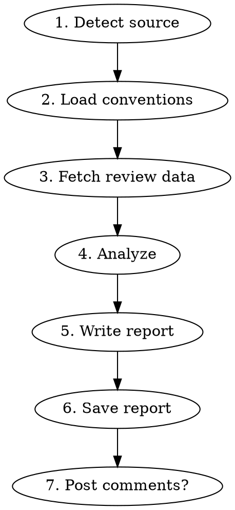

# Code Review with MCP

Structured code review powered by mcp-code-review MCP tools. Works on GitHub PRs, GitLab MRs, local git diffs, single files, and full projects.

## When to Use

- "Review this PR / MR"
- "Do a code review of the diff"
- "Review this file"
- "Scan this project for issues"
- Any request to analyze code quality, security, or performance

## Prerequisites

The `mcp-code-review` MCP server must be configured and running. Tools used:
- `review_github_pr`, `review_gitlab_mr`, `review_diff`, `review_file`, `review_project`
- `get_conventions`, `list_analyzers`
- `save_review_report`
- `post_github_review`, `post_gitlab_review`

## Process



---

## Phase 1: Detect Source

Determine what to review from the user's request:

| User says | Source | Tool to call |
|-----------|--------|-------------|
| URL with `github.com/.../pull/N` | GitHub PR | `review_github_pr` |
| URL with `gitlab.com/.../-/merge_requests/N` | GitLab MR | `review_gitlab_mr` |
| "review the diff" / "review my changes" | Local diff | `review_diff` |
| "review this file" + path | Single file | `review_file` |
| "scan the project" / "review the project" | Full project | `review_project` |

If the user provides a URL, parse it automatically. If ambiguous, ask.

## Phase 2: Load Conventions

Call `get_conventions(path)` to understand the project context:
- Language and framework (auto-detected or from `.codereview.yml`)
- Locale for the report (default: English)
- Ignore patterns and custom rules

If the user specifies a language for the report (e.g., "in italiano"), pass `locale="it"` to the review tool.

## Phase 3: Fetch Review Data

Call the appropriate tool from Phase 1. The tool returns structured `ReviewData`:
- Source metadata (title, author, branch, URL)
- File changes with diffs
- Static analysis findings (only for local diffs/files — ruff, bandit)
- Project conventions

## Phase 4: Analyze

This is where you reason on the data. Go through each file change systematically.

### Checklist

For **every file** in the diff, check:

**Correctness:**
- [ ] Does the code do what the PR/MR description says?
- [ ] Are there logic errors, off-by-one errors, or wrong conditions?
- [ ] Are edge cases handled? (empty input, null values, boundary conditions)

**Security:**
- [ ] No hardcoded secrets, tokens, or passwords
- [ ] Input validation on external data (user input, API responses)
- [ ] No SQL injection, XSS, command injection vectors
- [ ] Proper authentication/authorization checks
- [ ] Sensitive data not logged or exposed in error messages

**Performance:**
- [ ] No N+1 queries or queries in loops
- [ ] No unnecessary memory allocation (loading entire datasets when a subset suffices)
- [ ] Pagination used for large result sets
- [ ] Appropriate indexing for new database fields

**Code Quality:**
- [ ] Names are clear and accurate (describe what, not how)
- [ ] Functions have a single responsibility
- [ ] No code duplication (DRY)
- [ ] No dead code or unused imports
- [ ] Error handling is specific (no bare `except Exception`)
- [ ] Consistent with the codebase style and conventions

**Testing:**
- [ ] New code has tests
- [ ] Tests verify behavior, not implementation
- [ ] Edge cases are tested
- [ ] Existing tests still pass (no silent breakage)

**Documentation:**
- [ ] Public API changes are documented
- [ ] Non-obvious logic has comments explaining "why"
- [ ] Breaking changes are noted

### Static Analysis Findings

If the review data includes `static_analysis` findings, integrate them:
- Group by severity (error > warning > info)
- For each finding, check if it's a real issue or a false positive
- Include confirmed findings in the report with the linter's rule code

### Severity Classification

For each issue found, classify:

| Severity | Criteria | Action |
|----------|----------|--------|
| **Critical** | Security vulnerability, data loss risk, crash in production | Must fix before merge |
| **Important** | Bug, performance problem, missing validation | Should fix before merge |
| **Minor** | Style, naming, minor improvement | Nice to fix, not blocking |
| **Nitpick** | Personal preference, cosmetic | Optional, informational |

## Phase 5: Write Report

Structure the review as a markdown report. Use the locale from conventions for section headers.

### Report Structure

```markdown
# {Code Review title} — {PR/MR title}

**{Date label}:** YYYY-MM-DD
**{Author label}:** {author}
**{Branch label}:** {source} → {target}
**{Files changed label}:** N (+additions -deletions)

---

## {Summary}

[2-3 sentences: what the PR/MR does and overall assessment]

---

## {Code Quality}

### {Strengths}

[List what's done well — good patterns, clean code, thorough tests]

### {Issues Found}

[For each issue:]

#### Issue N: [title]

**File:** `path/to/file.py:line`
**Severity:** Critical / Important / Minor / Nitpick

```python
# the problematic code
```

**Problem:** [What's wrong and why it matters]

**Suggestion:**
```python
# how to fix it
```

---

## {Static Analysis}

| Tool | Errors | Warnings | Info |
|------|--------|----------|------|
| ruff | N | N | N |
| bandit | N | N | N |

[List significant findings with rule codes]

---

## {Security}

[Security-specific observations or "No security issues found."]

---

## {Performance}

[Performance-specific observations or "No performance issues found."]

---

## {Severity Summary}

| Issue | Severity | File | Impact |
|-------|----------|------|--------|
| ... | Critical/Important/Minor/Nitpick | file:line | ... |

---

## {Verdict}

- [ ] {Approved}
- [ ] {Approved with reservations}
- [ ] {Changes requested}
- [ ] {Rejected}

**{Rationale}:**

[Why this verdict. Summarize the key issues or confirm everything looks good.]
```

### Writing Rules

- Be specific: cite file paths and line numbers for every issue
- Be constructive: suggest fixes, don't just criticize
- Be proportional: a one-line fix gets a one-line comment, a design problem gets a paragraph
- Acknowledge good work: list strengths first
- Use the project's locale for section headers (the MCP tools return localized labels)

## Phase 6: Save Report

Call `save_review_report(title, content, output_dir)`.

The tool saves the file as `review-{slugified-title}-{date}.md`.

Report the saved file path to the user.

## Phase 7: Post Comments (Optional)

**Only if the user explicitly asks.** Never post automatically.

Ask: "Do you want me to post these comments on the PR/MR?"

If yes:
- For GitHub: call `post_github_review(pr_url, comments, verdict)`
- For GitLab: call `post_gitlab_review(mr_url, comments, verdict)`

The `comments` list should contain one entry per issue found:
```json
[
  {"path": "src/auth.py", "line": 42, "body": "Hardcoded secret detected. Use environment variable instead."},
  {"path": "src/views.py", "line": 15, "body": "Missing permission check before database write."}
]
```

Map the verdict:
- "Approved" → `verdict="approved"`
- "Approved with reservations" → `verdict="approved_with_reservations"`
- "Changes requested" → `verdict="changes_requested"`
- "Rejected" → `verdict="rejected"`

---

## Focus Modes

The user can request a focused review:

| Request | Focus parameter | What to emphasize |
|---------|----------------|-------------------|
| "security review" | `focus="security"` | OWASP top 10, auth, input validation, secrets |
| "performance review" | `focus="performance"` | N+1 queries, memory, caching, indexing |
| "quality review" | `focus="quality"` | DRY, naming, structure, tests |
| "full review" (default) | `focus="all"` | Everything |

Pass the `focus` parameter to the review tool — it filters static analysis results accordingly.

---

## Multi-Language Support

Reports are generated in the user's preferred language:

- Detect from user's request ("fai la review" → Italian, "haz la review" → Spanish)
- Or from `.codereview.yml` locale setting
- Or from `REVIEW_LOCALE` environment variable
- Default: English

Pass `locale` parameter to the review tool. Section headers, verdict labels, and standard phrases use the localized versions.

**Content language:** The analysis text (issue descriptions, suggestions) should be written in the same language as the section headers. If locale is "it", write the entire review in Italian.

---

## Quick Examples

### "Review this GitHub PR"

```
User: review https://github.com/org/repo/pull/42

1. get_conventions(".")
2. review_github_pr(url="https://github.com/org/repo/pull/42", focus="all")
3. [Analyze diffs using checklist]
4. save_review_report(title="PR #42 - Add auth", content="...")
5. "Review saved to review-pr-42-add-auth-2026-04-10.md. Want me to post comments on the PR?"
```

### "Review my local changes in Italian"

```
User: fai la review delle mie modifiche

1. get_conventions(".")
2. review_diff(path=".", base_branch="main", locale="it")
3. [Analyze diffs, write review in Italian]
4. save_review_report(title="Review diff locale", content="...")
```

### "Security review of this file"

```
User: security review of src/auth.py

1. review_file(path="src/auth.py", focus="security")
2. [Focus on security checklist items]
3. save_review_report(title="Security review auth.py", content="...")
```
